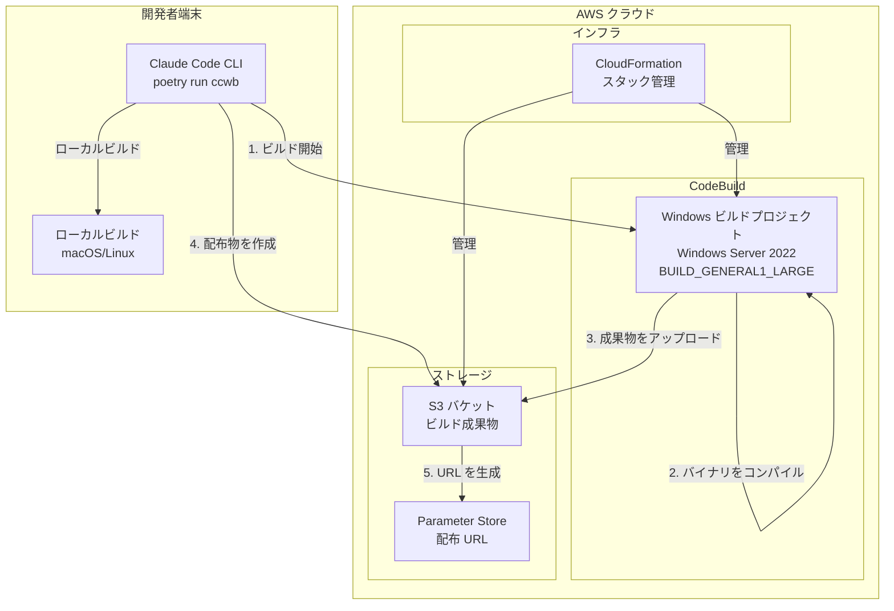
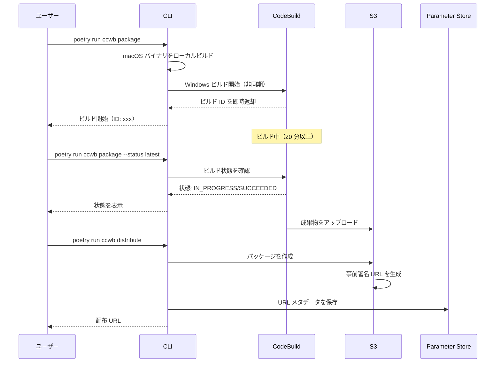
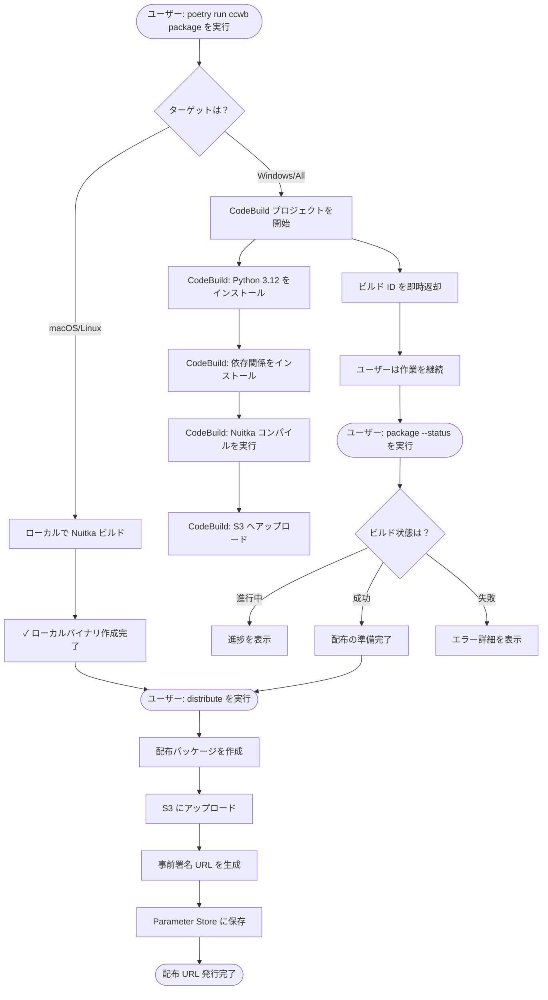

# Windows ビルドシステム ドキュメント

## 目次

1. [概要](#概要)
2. [アーキテクチャ](#アーキテクチャ)
3. [前提条件](#前提条件)
4. [初期セットアップ](#初期セットアップ)
5. [ビルドプロセス](#ビルドプロセス)
6. [CLI コマンド](#cli-コマンド)
7. [配布](#配布)
8. [トラブルシューティング](#トラブルシューティング)
9. [技術詳細](#技術詳細)

## 概要

Windows ビルドシステムは、Claude Code 認証ツール向けのネイティブ Windows 実行ファイルを IT 管理者が作成できるようにします。Nuitka はターゲットプラットフォーム上でのネイティブコンパイルを要求するため、Windows バイナリは Windows 環境でビルドする必要があります。これを AWS CodeBuild（Windows Server 2022 コンテナ）で実現します。

### 主な特長

- **クロスプラットフォーム対応**: Windows / macOS / Linux バイナリをビルド
- **非同期ビルド**: ブロッキングしないビルド開始と、ステータス追跡
- **セキュアな配布**: 期限付きの事前署名 URL による配布
- **自動コンパイル**: Python→ネイティブ変換に Nuitka を使用
- **手動介入なし**: CLI コマンドで完全自動化

## アーキテクチャ

### システム構成要素



### ビルドフロー（シーケンス）



## 前提条件

### ローカル要件

- Python 3.10 / 3.11 / 3.12（3.13+ は不可）
- Poetry（パッケージマネージャ）
- AWS CLI v2（設定済み）
- Git

### AWS 要件

- 適切な IAM 権限を持つ AWS アカウント
- CloudFormation スタックを作成できること
- 次の権限：
  - CodeBuild プロジェクト
  - S3 バケット
  - Systems Manager Parameter Store
  - CloudWatch Logs

## 初期セットアップ

### 1. リポジトリのクローン

```bash
git clone <repository-url>
cd guidance-for-claude-code-with-amazon-bedrock/source
```

### 2. 依存関係のインストール

```bash
poetry install
```

### 3. 設定の初期化

```bash
poetry run ccwb init
```

初期化中に次を尋ねられます。

- Id プロバイダーのドメイン（例: `us-east-1xxxxx.auth.us-east-1.amazoncognito.com`）
- Id プロバイダーの Client ID
- デプロイ先 AWS リージョン
- Bedrock のクロスリージョンアクセス設定
- **Windows バイナリビルドのため CodeBuild を有効化しますか？ [Y/n]** — Yes を選択
- モニタリング設定

### 4. インフラのデプロイ

```bash
poetry run ccwb deploy
```

これにより次の CloudFormation スタックが作成されます。

- **認証スタック**: IAM ロール、identity pool
- **ネットワーキングスタック**: VPC とサブネット（モニタリング有効時）
- **モニタリングスタック**: OpenTelemetry collector（任意）
- **CodeBuild スタック**: Windows ビルドプロジェクト
- **ダッシュボードスタック**: CloudWatch ダッシュボード（任意）
- **分析スタック**: Athena と Kinesis（任意）

### 5. CodeBuild デプロイの確認

```bash
poetry run ccwb status
```

CodeBuild がデプロイされていることを確認します。

```
CodeBuild Stack:
• Status: CREATE_COMPLETE
• Project: claude-code-auth-windows-build
• S3 Bucket: claude-code-auth-codebuild-buildbucket-xxxxx
```

## ビルドプロセス

### ビルド開始

package コマンドは既定で非同期動作します。

```bash
poetry run ccwb package
```

出力例：

```
Fetching deployment information...
╭─────────────────────────────────────────────────────────────╮
│                                                             │
│  Package Builder                                            │
│                                                             │
│  Creating distribution package for                          │
│  us-east-1xxxxx.auth.us-east-1.amazoncognito.com           │
│                                                             │
╰─────────────────────────────────────────────────────────────╯

Package Configuration:
  Configuration Profile: default
  AWS Profile: ClaudeCode
  OIDC Provider: us-east-1xxxxx.auth.us-east-1.amazoncognito.com
  Client ID: 3k67m9eb6c78o2tgnk7hjhd169
  AWS Region: us-east-1
  Identity Pool: us-east-1:1a794053-7af4-444d-b2cd-c35f22daecca
  Claude Model: Claude Opus 4.1
  Source Region: us-west-2
  Bedrock Regions: US Cross-Region (us-east-1, us-east-2, us-west-2)

Building package...
✓ Building credential process for macos...
✓ Building OTEL helper for macos...

Build ID: claude-code-auth-windows-build:abc123-def456-789
Estimated cost: ~$0.10

Windows build started!
Build will take approximately 12-15 minutes to complete.

To check status:
  poetry run ccwb package --status claude-code-auth-windows-build:abc123-def456-789

To view logs in AWS Console:
  https://console.aws.amazon.com/codesuite/codebuild/projects/claude-code-auth-windows-build/build/abc123-def456-789
```

### ビルド状態の確認

最新ビルドを確認：

```bash
poetry run ccwb package --status latest
```

特定ビルドを確認：

```bash
poetry run ccwb package --status claude-code-auth-windows-build:abc123-def456-789
```

状態出力例：

```
⏳ ビルド進行中
Phase: BUILD
Elapsed: 5 minutes

✓ ビルド成功！
Duration: 13 minutes
Artifacts are ready. Run the following to complete packaging:
poetry run ccwb package --complete

✗ ビルド失敗
Failed in phase: BUILD
```

### 最近のビルド一覧

```bash
poetry run ccwb builds
```

出力例：

```
               Recent Builds for claude-code-auth-windows-build
┏━━━━━━━━━━┳━━━━━━━━━━━━━━━━┳━━━━━━━━━━━━━━━━━━┳━━━━━━━━━━┳━━━━━━━━━━━┓
┃ Build ID ┃ Status         ┃ Started          ┃ Duration ┃ Phase     ┃
┡━━━━━━━━━━╇━━━━━━━━━━━━━━━━╇━━━━━━━━━━━━━━━━━━╇━━━━━━━━━━╇━━━━━━━━━━━┩
│ abc12345 │ ✓ Succeeded    │ 2024-08-24 10:30 │ 13 min   │ COMPLETED │
│ def67890 │ ✓ Succeeded    │ 2024-08-24 09:15 │ 12 min   │ COMPLETED │
│ ghi11111 │ ✗ Failed       │ 2024-08-24 08:00 │ 2 min    │ BUILD     │
└──────────┴────────────────┴──────────────────┴──────────┴───────────┘
```

## CLI コマンド

### package コマンド

**基本:**

```bash
poetry run ccwb package [options]
```

**オプション:**

| オプション | 説明 | 既定 |
|--------|-------------|---------|
| `--target-platform` | ビルド対象プラットフォーム（macos/linux/windows/all） | all |
| `--profile` | 使用する設定プロファイル | default |
| `--distribute` | ビルド後に配布物を作成 | false |
| `--expires-hours` | 配布 URL の有効期限（1-168） | 48 |
| `--status` | ビルド状態を確認（build-id または "latest"） | - |

**例:**

全プラットフォーム向けにビルド（Windows は即時リターン）：

```bash
poetry run ccwb package
```

ビルドして配布：

```bash
poetry run ccwb package --distribute
```

状態確認：

```bash
poetry run ccwb package --status latest
```

### builds コマンド

**基本:**

```bash
poetry run ccwb builds [options]
```

**オプション:**

| オプション | 説明 | 既定 |
|--------|-------------|---------|
| `--limit` | 表示するビルド数 | 10 |
| `--project` | CodeBuild プロジェクト名 | 自動検出 |

### distribute コマンド

**基本:**

```bash
poetry run ccwb distribute [options]
```

**オプション:**

| オプション | 説明 | 既定 |
|--------|-------------|---------|
| `--get-latest` | 新規作成せず既存 URL を取得 | false |
| `--expires-hours` | URL の有効期限（1-168） | 48 |
| `--package-path` | パッケージディレクトリのパス | dist |
| `--allowed-ips` | IP 制限（カンマ区切り） | - |
| `--qr` | QR コードを生成 | false |

**例:**

新規配布を作成：

```bash
poetry run ccwb distribute
```

既存 URL を取得：

```bash
poetry run ccwb distribute --get-latest
```

## 配布

### パッケージ内容

配布パッケージ（`dist/`）には次が含まれます。

```
dist/
├── credential-process-windows.exe      # Windows 認証バイナリ（約 28MB）
├── credential-process-macos-arm64      # macOS ARM64 バイナリ（約 26MB）
├── otel-helper-windows.exe            # Windows テレメトリヘルパー（約 28MB）
├── otel-helper-macos-arm64            # macOS テレメトリヘルパー（約 26MB）
├── config.json                        # Cognito 設定を含む構成
├── install.sh                         # macOS/Linux インストーラ
├── install.bat                        # Windows インストーラ
├── README.md                          # インストール手順
└── .claude/
    └── settings.json                  # Claude Code テレメトリ設定
```

### エンドユーザーのインストール

**Windows:**

```batch
REM パッケージをダウンロード
curl -L -o claude-code-package.zip "<presigned-url>"

REM 展開
tar -xf claude-code-package.zip

REM インストール
cd dist
install.bat
```

**macOS/Linux:**

```bash
# パッケージをダウンロード
curl -L -o claude-code-package.zip "<presigned-url>"

# 展開
unzip claude-code-package.zip

# インストール
cd dist
./install.sh
```

インストーラは次を行います。

1. `~/claude-code-with-bedrock/` ディレクトリを作成
2. バイナリをディレクトリへコピー
3. `ClaudeCode` という AWS CLI プロファイルを設定
4. 認証をテスト

## トラブルシューティング

### よくあるビルド問題

#### 1. ビルドが即時失敗する

**エラー:** "The Python version '3.12' is not supported by Nuitka '2.0'"  
**対処:** これは修正済みです。現在は Python 3.12 をサポートする Nuitka 2.7.12 を使用します。

#### 2. ビルドがタイムアウトする

**エラー:** "Build timed out after 20 minutes"  
**対処:** 通常のビルド時間は 12～15 分です。コンパイルエラーの有無を CodeBuild ログで確認してください。

#### 3. 成果物が見つからない

**エラー:** "no matching artifact paths found"  
**対処:** ビルドフェーズが成功していることを確認してください。

```bash
aws logs tail /aws/codebuild/claude-code-auth-windows-build --region us-east-1 --since 30m
```

#### 4. PowerShell の構文エラー

**エラー:** "The term 'SET' is not recognized"  
**対処:** CodeBuild は CMD ではなく PowerShell を使用します。buildspec は PowerShell 構文を使うよう更新済みです。

### ビルドログの確認

**AWS CLI で確認:**

```bash
# 最近のログを取得
aws logs tail /aws/codebuild/claude-code-auth-windows-build \
  --region us-east-1 \
  --since 30m

# エラーを検索
aws logs filter-log-events \
  --log-group-name /aws/codebuild/claude-code-auth-windows-build \
  --region us-east-1 \
  --filter-pattern "ERROR"
```

**コンソールで確認:**
package コマンドは、各ビルドの AWS コンソールへの直接リンクを表示します。

## 技術詳細

### Windows ビルド環境

**CodeBuild 設定:**

- **環境タイプ:** `WINDOWS_SERVER_2022_CONTAINER`
- **コンピュートタイプ:** `BUILD_GENERAL1_LARGE`（4 vCPU、8 GB メモリ）
- **ベースイメージ:** `aws/codebuild/windows-base:2022-1.0`
- **タイムアウト:** 30 分
- **リージョン:** us-east-1（整合性のためハードコード）

### ソフトウェアバージョン

**ビルド環境:**

- Windows Server 2022
- Python 3.12.10（Chocolatey でインストール）
- Nuitka 2.7.12
- pip 24.x

**ビルド中にインストールされる依存関係:**

- nuitka==2.7.12
- ordered-set
- zstandard
- boto3
- requests
- PyJWT
- keyring
- cryptography
- questionary
- rich
- cleo
- pydantic
- pyyaml

### Nuitka のコンパイル設定

```bash
C:\Python312\python.exe -m nuitka \
  --standalone \                    # 依存関係をすべて同梱
  --onefile \                       # 単一実行ファイル
  --assume-yes-for-downloads \      # 必要物の自動ダウンロード
  --windows-disable-console \       # コンソールウィンドウのポップアップを抑止
  --company-name="Claude Code" \
  --product-name="Claude Code Credential Process" \
  --file-version="1.0.0.0" \
  --product-version="1.0.0.0" \
  --windows-file-description="AWS Credential Process for Claude Code" \
  --output-filename=credential-process-windows.exe \
  --output-dir=. \
  --remove-output \                 # ビルド成果物をクリーンアップ
  source/credential_provider/__main__.py
```

### ビルド性能

**典型的なビルド時間:**

- macOS ARM64（ローカル）: 約 30 秒
- Windows（CodeBuild）: 12～15 分
  - Install: 約 1 分
  - Pre-build（依存関係）: 約 2 分
  - Build（Nuitka コンパイル）: 約 10～12 分
  - Post-build: 約 30 秒

**最適化の経緯:**

1. 初期: PyInstaller + MEDIUM → 16 分以上
2. Nuitka 2.0.0 + MEDIUM → 失敗（Python 3.12 非互換）
3. Nuitka 2.7.12 + LARGE → 12～13 分（現状）
4. 2XLARGE を試行 → Windows コンテナでは未対応

### セキュリティ

**S3 バケット:**

- プライベートバケット（バージョニング有効）
- サーバーサイド暗号化（SSE-S3）
- 古いパッケージ向けライフサイクルルール（90 日）

**事前署名 URL:**

- 既定の有効期限: 48 時間
- 最大有効期限: 168 時間（7 日）
- バケットポリシーによる任意の IP 制限

**必要な IAM 権限:**

```json
{
  "Version": "2012-10-17",
  "Statement": [
    {
      "Effect": "Allow",
      "Action": [
        "codebuild:StartBuild",
        "codebuild:BatchGetBuilds",
        "codebuild:ListBuildsForProject"
      ],
      "Resource": "arn:aws:codebuild:us-east-1:*:project/claude-code-auth-windows-build"
    },
    {
      "Effect": "Allow",
      "Action": ["s3:PutObject", "s3:GetObject", "s3:ListBucket"],
      "Resource": [
        "arn:aws:s3:::claude-code-auth-codebuild-buildbucket-*",
        "arn:aws:s3:::claude-code-auth-codebuild-buildbucket-*/*"
      ]
    },
    {
      "Effect": "Allow",
      "Action": ["ssm:PutParameter", "ssm:GetParameter"],
      "Resource": "arn:aws:ssm:*:*:parameter/claude-code/*"
    }
  ]
}
```

### コスト分析

**1 ビルドあたり:**

- CodeBuild: 約 $0.10（LARGE インスタンス $0.005/分 × 13 分）
- S3 ストレージ: 約 $0.01（100MB 保存）
- データ転送: ダウンロード量により変動

**月額目安（毎日ビルド）:**

- 30 ビルド × $0.10 = $3.00（CodeBuild）
- ストレージ: 約 $0.50
- **合計: 約 $3.50/月**

### ファイルシステム上の配置

**ソースファイル:**

```
/source/
├── credential_provider/
│   └── __main__.py           # メイン認証モジュール
├── otel_helper/
│   └── __main__.py           # テレメトリヘルパーモジュール
├── claude_code_with_bedrock/
│   └── cli/
│       └── commands/
│           ├── package.py    # パッケージビルドロジック
│           ├── builds.py     # ビルド一覧ロジック
│           └── distribute.py # 配布ロジック
└── deployment/
    └── infrastructure/
        └── codebuild-windows.yaml  # CodeBuild 用 CloudFormation
```

**ビルド成果物:**

```
~/.claude-code/
└── latest-build.json         # 最新ビルドのメタデータ

dist/                         # ローカルのパッケージ出力
└── [platform binaries]

S3: claude-code-auth-codebuild-buildbucket-xxxxx/
├── windows-binaries.zip      # Windows ビルド成果物
└── packages/
    └── YYYYMMDD-HHMMSS/
        └── claude-code-package-*.zip
```

## 付録

### ビルドプロセス全体フロー



### クイックリファレンスカード

```bash
# 日常の流れ
poetry run ccwb package                    # ビルド開始（非同期）
poetry run ccwb builds                     # 最近のビルドを確認
poetry run ccwb package --status latest    # 完了したか確認
poetry run ccwb distribute                 # 配布を作成

# 既存 URL を取得（再ビルドなし）
poetry run ccwb distribute --get-latest

# 失敗したビルドのデバッグ
poetry run ccwb package --status latest
aws logs tail /aws/codebuild/claude-code-auth-windows-build --region us-east-1

# 配布期限を延長（7 日）
poetry run ccwb distribute --expires-hours 168
```

---

_最終更新: 2024 年 8 月_  
_バージョン: 1.0.0_
