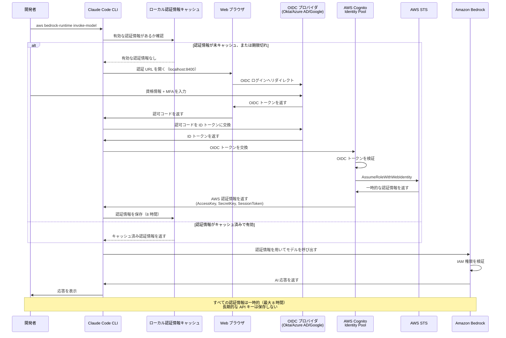
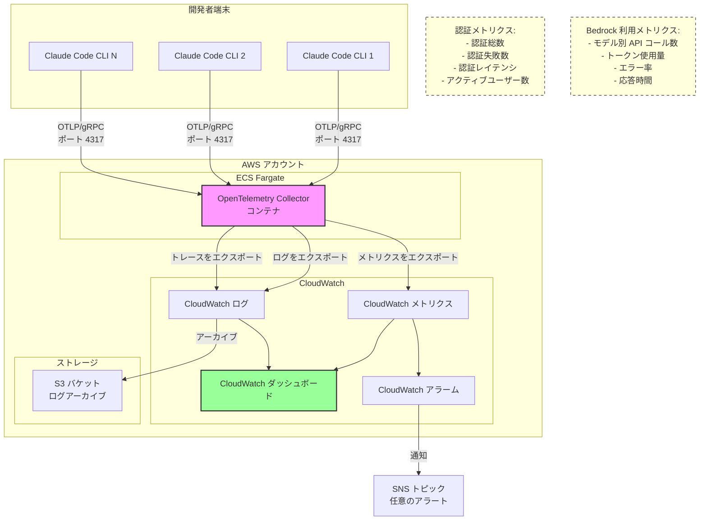

# アーキテクチャ図

## 1. 認証およびクレデンシャル取得フロー

この図は、一時的な AWS 認証情報を取得し、それを使って Amazon Bedrock にアクセスするまでの全プロセスを示します。

## 2. OpenTelemetry 監視アーキテクチャ

この図は、ECS Fargate 上の OpenTelemetry Collector を用いた（任意の）監視構成を示します。

## AWS アーキテクチャアイコン要件

公式の AWS アーキテクチャ図（PNG 形式）を作成する場合:

- AWS Architecture Icons Toolkit の最新版（明るい背景、2023-04-28 リリース）を使用
- サービスアイコンは 0.4"×0.4" 以上、グルーピング用アイコンは 0.3"×0.3" 以上
- すべてのアイコンに下部ラベルを付ける（Arial 9〜12pt、黒）
- サービス名の先頭語と同じ行に "AWS" または "Amazon" を含める
- 矢印は黒の実線（線幅 1.25pt）、斜め線は使用しない
- トリミング、反転、形状変更は禁止

## 主要アーキテクチャ要素

1. **開発者ワークステーション**: Claude Code CLI を実行し、ローカルで認証情報をキャッシュ
2. **OIDC プロバイダ**: エンタープライズ向け IdP（Okta、Azure AD、Google Workspace）
3. **Amazon Cognito Identity Pool**: OIDC トークンを検証し、ID フェデレーションを管理
4. **AWS STS**: AssumeRoleWithWebIdentity により一時的な認証情報を発行
5. **Amazon Bedrock**: 一時的な認証情報でアクセスする対象 AI サービス
6. **AWS CloudTrail**: 認証および API アクセスイベントをすべて記録
7. **Amazon CloudWatch**: （任意）監視ダッシュボードとアラート
8. **Amazon ECS Fargate**: 集約テレメトリのための OpenTelemetry Collector をホスト
